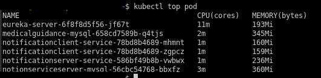

## 依赖

```shell
pip3 install coloredlogs kubernetes
```

## 实验方法

1. 新建分支 'exp'，并切换到新分支
2. mockup 所有的外部服务请求调用，直接生成返回结果。如果返回结果处理流程中涉及到 if、while
等情况，需要多构建几个返回结果确保执行覆盖率，并每次请求时从中随机选取一个作为 mockup 的结果
3. 准备配置文件，见最后一小节”配置文件“
4. 考虑到实验环境差异问题，统一使用 102 服务器进行测试

## 流程


## 配置文件

见 `./resource/config-template.yaml`


## 用户请求模拟使用说明
请求数据按照**配置文件**中**data**进行配置：
1. 请求的路径对应子文件路径，例如，请求路径为/cloud/report，则文件夹路径为data\cloud\report。
2. 子文件夹下以**json**文件格式保存请求数据，一个数据对应一个json文件，例如data\cloud\report下保存若干json文件。

结果按照**配置文件**中**result**进行配置：
1. 结果文件将保存在在result文件夹下，文件将命名为 _实验名-用户数_。
2. 结果的格式为（用户id，[(发起时间，响应时间，成功/失败)···]）


## metrics-server
安装需要的依赖
~~~shell script
pip3 install --no-cache-dir -r requirements.txt
~~~
获取信息为



其中CPU(cores)表示核数， `1核 = 1000m`
~~~shell script
kubectl apply -f ./resource/metrics-erver/metrics-server.yaml
#kubectl delete ./resource/metrics-erver/metrics-server.yaml
~~~
这里通过shell指令获取 某一命名空间下的pod的资源消耗


## users
### 用户请求
生成数据脚本可以写在productData中， 最后生成的是json的数组，并放到相应的文件中
~~~json
[
  {
    "urlpath": "user/login", % 接口
    "needparam" : True,    % 没有填写成为False（python的形式）
    "param" : [            %请求的参数,json形式， 
      {
        "username": "id" ,
        "password" : "password"
      }

    ]
  },{ % 第二个请求的接口信息
  
  }
]
~~~
